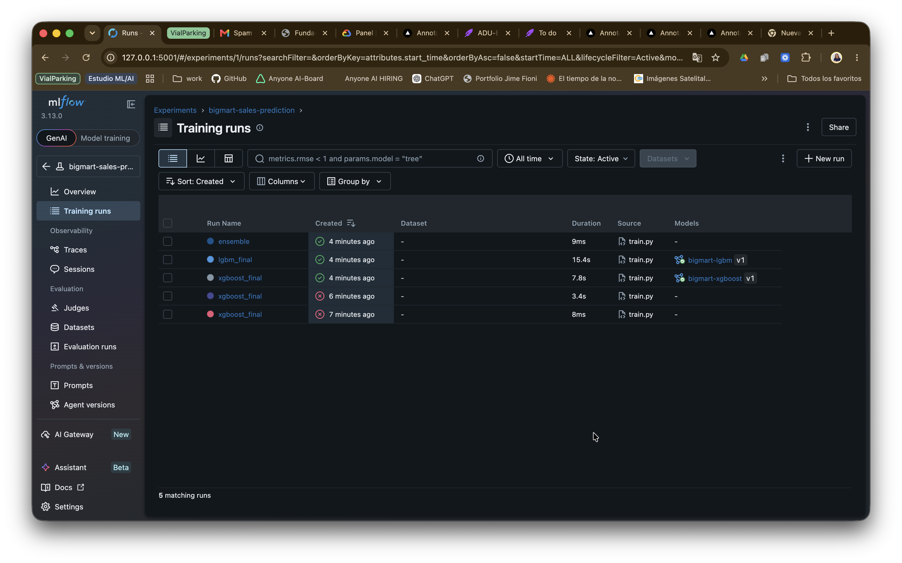
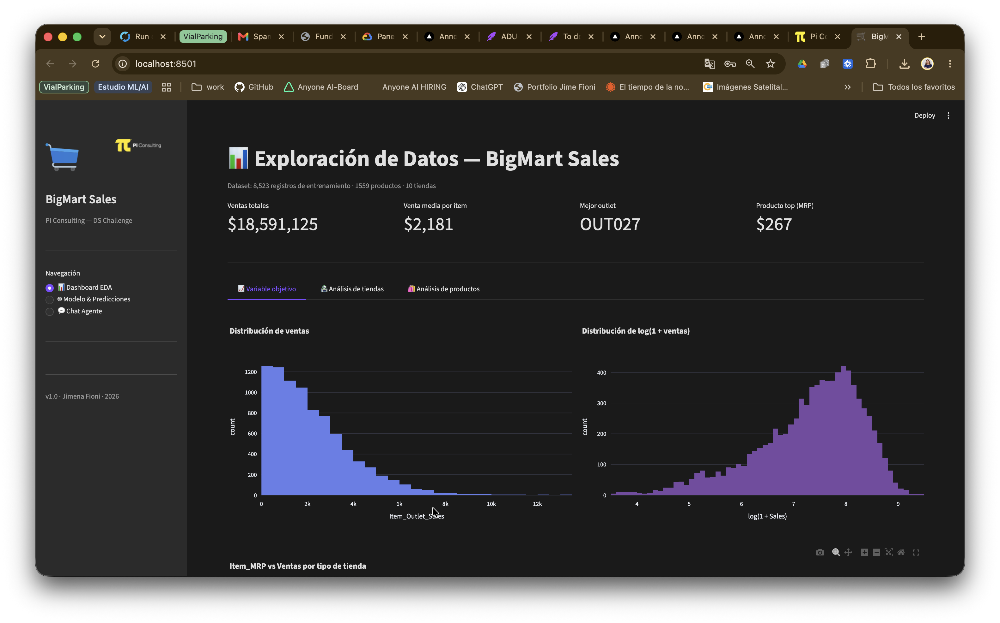
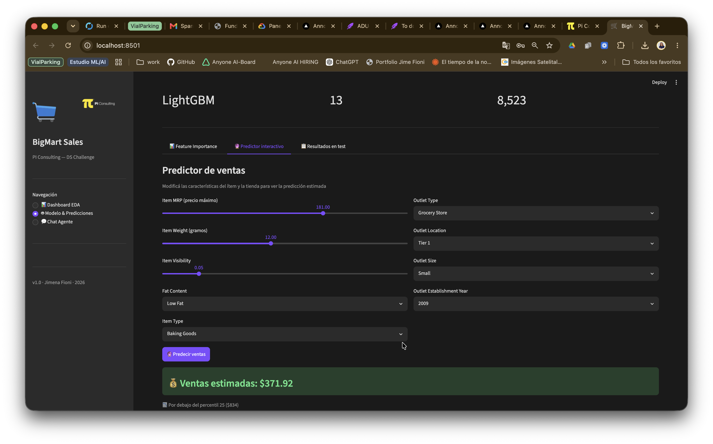
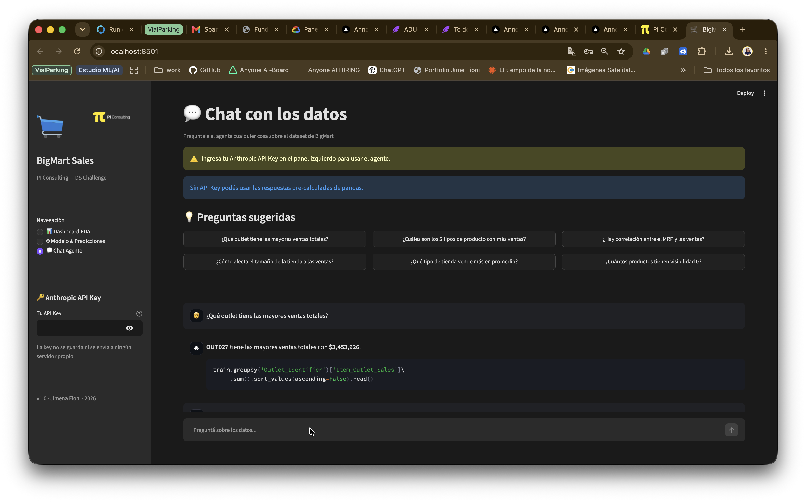

# 🛒 BigMart Sales Prediction

## PI Consulting — Data Scientist Challenge

Predicción de ventas por producto usando regresión, con análisis exploratorio completo, pipeline de experimentación con MLflow + Optuna, y app interactiva con agente conversacional de IA.

---

## 📁 Estructura del proyecto

```text
DS 2026/
├── Train_BigMart.csv              # Datos de entrenamiento (8,523 registros)
├── Test_BigMart.csv               # Datos de test (5,681 registros)
│
├── src/                           # Módulos reutilizables (estilo producción)
│   ├── __init__.py
│   ├── preprocessing.py           # Custom sklearn transformers (limpieza)
│   └── features.py                # Custom sklearn transformers (feature engineering)
│
├── bigmart_analysis.ipynb         # Notebook principal (EDA + modelos)
├── train.py                       # Script de entrenamiento: MLflow + Optuna
├── config.yaml                    # Hiperparámetros y paths (sin hardcodear nada)
├── app.py                         # Streamlit app con agente conversacional
├── requirements.txt               # Dependencias
├── images/                        # Capturas de pantalla y logos
│
├── mlflow.db                      # Generado automáticamente por train.py
└── predictions_test.csv           # Generado al correr el notebook o train.py
```

---

## 🚀 Setup

```bash
# 1. Crear entorno virtual
python -m venv venv
source venv/bin/activate        # Mac/Linux
# venv\Scripts\activate         # Windows

# 2. Instalar dependencias
pip install -r requirements.txt

# 3. Abrir el notebook
jupyter notebook bigmart_analysis.ipynb

# 4. [OPCIONAL] Correr el pipeline MLflow + Optuna
python train.py                    # busca hiperparámetros con Optuna (30 trials)
python train.py --n-trials 100     # más trials para mejor resultado
python train.py --model lgbm       # solo LightGBM
python train.py --no-optuna        # usa params del config.yaml sin buscar

# 5. Ver experimentos en MLflow UI
mlflow ui --backend-store-uri sqlite:///mlflow.db --port 5001
# → Abrí http://localhost:5001 en el browser

# 6. Correr la app Streamlit
streamlit run app.py
# → Abrí http://localhost:8501 en el browser
```

---

## 🧪 MLflow + Optuna — Pipeline de experimentación

`train.py` integra búsqueda bayesiana de hiperparámetros con tracking completo de experimentos:

- **Optuna** con sampler TPE y pruning (MedianPruner) — descarta trials malos tempranamente
- **MLflow** para tracking: cada trial de Optuna queda como nested run con sus métricas
- **MLflow Model Registry**: el modelo final se registra automáticamente
- **config.yaml** centraliza todos los hiperparámetros (nada hardcodeado)
- **Sin data leakage**: los transformers de `src/` se fittean solo sobre train

```text
MLflow Experiment: bigmart-sales-prediction
├── run: xgboost_final
│   ├── nested: xgb_trial_0   (CV RMSE: 1095.3)
│   ├── nested: xgb_trial_1   (CV RMSE: 1082.7)
│   └── ...
├── run: lgbm_final
│   ├── nested: lgbm_trial_0
│   └── ...
└── run: ensemble
```

### Experimentos registrados



---

## 📊 Notebook — Contenido

1. **EDA**: distribuciones, correlaciones, análisis por tienda y producto
2. **Limpieza**: imputación de Item_Weight y Outlet_Size, normalización de Item_Fat_Content, corrección de visibilidad cero
3. **Feature Engineering**: Outlet_Age, Item_Visibility_MeanRatio, Item_Category, MRP_Tier, interacciones MRP×OutletType, target encoding
4. **Modelos evaluados**:
   - Baseline (media)
   - Ridge Regression
   - Random Forest
   - XGBoost (base + tuneado con Optuna)
   - LightGBM (base + tuneado con Optuna)
   - CatBoost (manejo nativo de categóricas)
   - MLP — Red Neuronal (scikit-learn)
   - XGBoost + RandomizedSearchCV
   - **Stacking Ensemble** (meta-learner Ridge sobre OOF de XGB + LGB + RF + CatBoost)
5. **Selección automática** del mejor modelo por RMSE en validación cruzada
6. **Predicciones** exportadas a `predictions_test.csv` con columna por cada modelo

---

## 💬 Streamlit App

App interactiva con tres secciones:

### 📊 Dashboard EDA

Visualizaciones interactivas sobre el dataset: distribuciones, ventas por tienda, análisis de productos y correlaciones.



---

### 🤖 Modelo & Predicciones

Feature importance del modelo + predictor interactivo: ajustá MRP, tipo de tienda, peso y más para obtener una predicción de ventas en tiempo real.



---

### 💬 Chat con Agente de IA

Agente conversacional construido sobre la API de Claude (Anthropic). Responde preguntas sobre el dataset con código Python ejecutable como respaldo.



Para el chat agente, obtené tu API Key en [console.anthropic.com](https://console.anthropic.com).

---

## 🔑 Hallazgos principales

- **Item_MRP** es el predictor más fuerte (correlación ~0.57 con ventas)
- **Supermarket Type3** vende ~6x más que Grocery Store
- **Outlet_Age** tiene impacto: tiendas antiguas y bien establecidas venden más
- **Item_Visibility = 0** es un error de datos (526 registros) → imputado con media por ítem
- El **Stacking Ensemble** (XGBoost + LightGBM + Random Forest + CatBoost) da el mejor resultado

---

## 💡 Fuentes de datos adicionales sugeridas

- Datos demográficos por zona (ingreso, densidad poblacional)
- Datos de competencia local
- Estacionalidad / fechas de transacción
- Historial de promociones y descuentos
- Tráfico de clientes por tienda

---

## 📚 Referencias y documentación

### Herramientas y frameworks

- [MLflow Documentation](https://mlflow.org/docs/latest/index.html) — Experiment tracking y Model Registry
- [Streamlit Documentation](https://docs.streamlit.io) — Framework para apps de datos interactivas
- [Optuna Documentation](https://optuna.readthedocs.io) — Búsqueda bayesiana de hiperparámetros
- [Anthropic API (Claude)](https://docs.anthropic.com) — Agente conversacional de IA

### Modelos y librerías de ML

- [XGBoost Documentation](https://xgboost.readthedocs.io) — Gradient boosting optimizado
- [LightGBM Documentation](https://lightgbm.readthedocs.io) — Gradient boosting eficiente de Microsoft
- [CatBoost Documentation](https://catboost.ai/docs) — Gradient boosting con soporte nativo de categóricas (Yandex)
- [scikit-learn Documentation](https://scikit-learn.org/stable/) — Pipeline, métricas, modelos base y MLPRegressor

### Técnicas aplicadas

- [Stacking Ensembles — scikit-learn](https://scikit-learn.org/stable/modules/ensemble.html#stacking) — Meta-learner sobre predicciones OOF
- [Target Encoding](https://contrib.scikit-learn.org/category_encoders/targetencoder.html) — Encoding sin data leakage
- [Cross-validation strategies](https://scikit-learn.org/stable/modules/cross_validation.html) — KFold con OOF predictions

### Dataset

- [BigMart Sales Dataset — Analytics Vidhya](https://datahack.analyticsvidhya.com/contest/practice-problem-big-mart-sales-iii/) — Fuente original del dataset de entrenamiento y test
